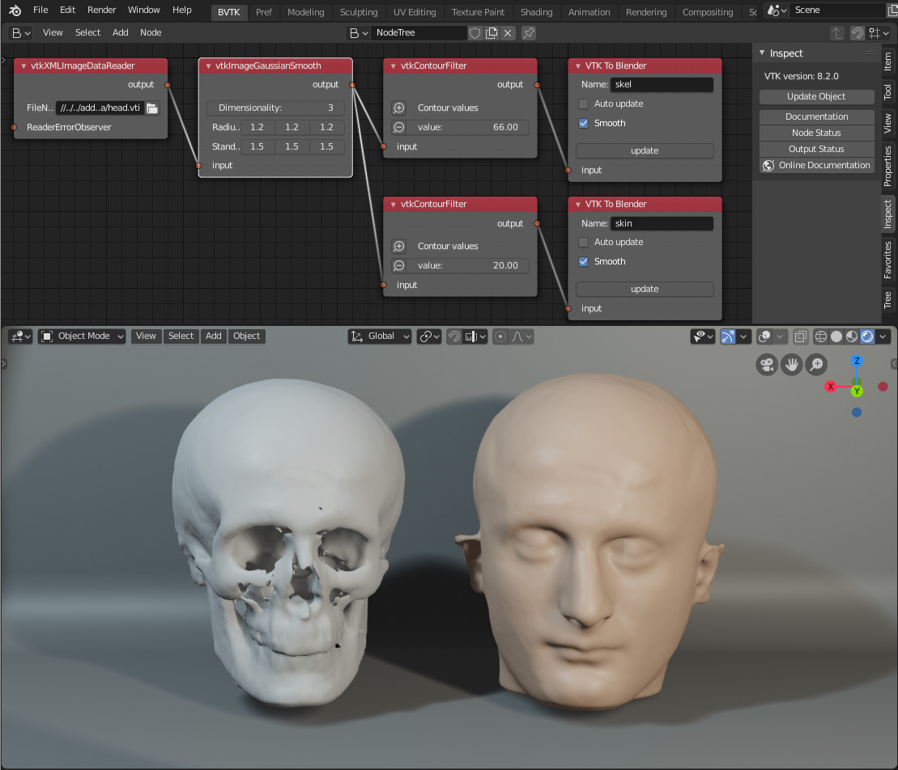

# BVtkNodes 
The Visualization Toolkit (VTK https://www.vtk.org/ ) is an open source library for scientific visualization developed by Kitware. BVtkNodes is a Blender Addon allowing to use VTK within Blender.

**addon for**: [Blender](http://blender.org) version *2.79*.  
**current version**: beta 1.0   
**license**: [GPL3](http://www.gnu.org/licenses/quick-guide-gplv3.html)   
**contributors**: Silvano Imboden (s.imboden@cineca.it) , Lorenzo Celli, Paul Mc Manus

### Prerequisites: 
__VTK (version 7 and above) and VTK python wrappers compatible with the python used in Blender.__   
For Ubuntu 16.04 and above you may try the following binaries [BVtkBinaries.zip]( https://drive.google.com/file/d/1-t7bhygXidgwJE0Y_WLV9q0Tw198_XUe )(147MB).         
To build VTK your own please look here: [build_vtk_for_blender]( ./build_vtk.md ).     

### Goals:
- verify the feasibility of using VTK inside Blender
- provide a tools to quickly learn VTK and prototiping VTK pipelines.

### Desiderable side effects:
- provide Blender users with readers for many scientific data format, and techniques to convert them to blender mesh.
- provide VTK users with hi-quality-rendering and many kind of mesh editing tools.

### Installation:
- verify the prerequisites
- download [BVtkNodes.zip]( http://github.com/simboden/BVtkNodes/blob/master/BVtkNodes.zip )
- Blender menu > User Preferences > Addons > install from file > choose the zip-archive > activate flag beside BVtkNodes

