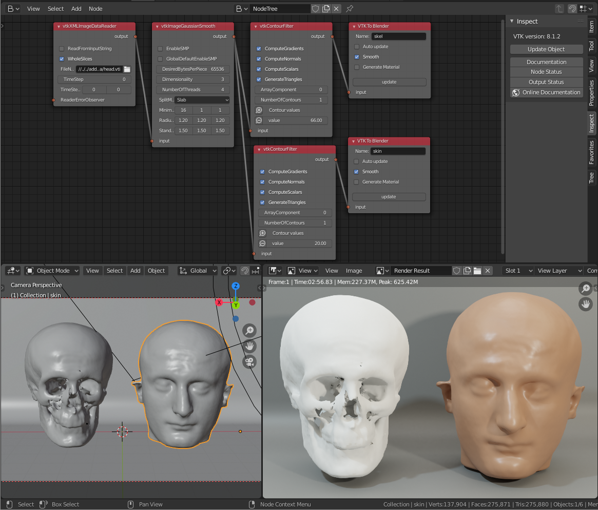
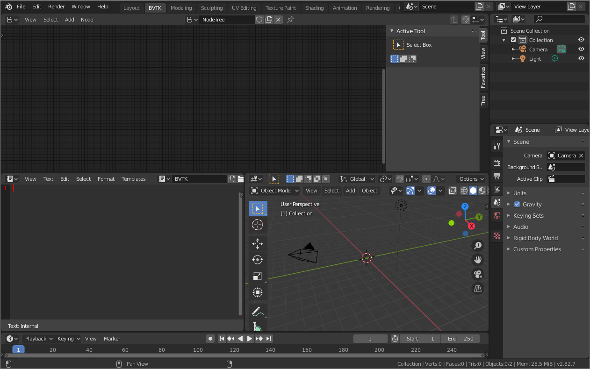
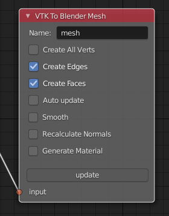
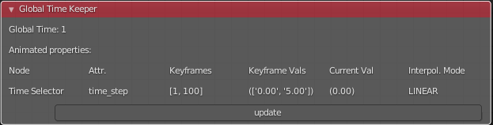

BVTKNodes Addon for Blender
===========================

Introduction
------------

`The Visualization Toolkit (VTK) <https://www.vtk.org/>`_ is an open
source library for scientific data processing and visualization.
BVTKNodes is an addon for 
`Blender (an open source 3D content creation and visualization tool) <https://www.blender.org/>`_.
This addon makes it possible to create and execute VTK pipelines
configured in Blender Node Editor, to produce objects like surface meshes,
which can be then modified and visualized in Blender.

BVTKNodes provides Blender users with access to data readers for many
scientific data formats, along with capability to convert VTK data
into Blender objects. For VTK users, the add-on provides access to high
quality photorealistic rendering and many kinds of mesh editing tools.
The add-on was first presented at
`Blender Conference 2018 <https://www.youtube.com/watch?v=KcF4LBTTyvk>`_.
You can see more examples in
`a gallery thread on blenderartists <https://blenderartists.org/t/bvtknodes-gallery/1161079>`_.

Target Use and Users
--------------------

BVTKNodes integrates VTK's data processing capabilities with Blender's
powerful visualization features. It allows creation of **photorealistic**
images and animations from scientific data.

Use of BVTKNodes requires both Blender and VTK skills. User needs to
know at least Blender 3D Viewport, Node Editor, Materials, Lighting
and Rendering basics, as well as VTK (to the extent required by users'
specific case). If photorealistic rendering or specialized VTK
pipelines are not required, then it is suggested to use `Paraview
<https://www.paraview.org/>`_ instead.

To learn Blender, see resources at `blender.org <https://www.blender.org/>`_
, `Blender 2.8 fundamentals series in Youtube <https://www.youtube.com/playlist?list=PLa1F2ddGya_-UvuAqHAksYnB0qL9yWDO6>`_ and search for Blender tutorials on a topic.
To learn VTK, see `VTK wiki <https://vtk.org/Wiki/VTK/Learning_VTK>`_,
`the VTK Textbook <https://vtk.org/vtk-textbook/>`_
and view `VTK discourse forum <https://discourse.vtk.org/>`_.
For BVTKNodes, see :ref:`help`.

Technical Details and Limitations
---------------------------------

BVTKNodes is based on automatic generation of Blender Node classes
from VTK Python classes. Simply put, the addon makes VTK classes
available as nodes in Blender. A manually programmed node class can
supercede automatically generated code where needed. It is fairly easy
to upgrade/downgrade to another VTK version, including customized VTK
builds, so this makes BVTKNodes an option for prototyping and testing of
VTK pipelines.

BVTKNodes includes many custom made nodes that make it possible to
access VTK time step data, multi block data, and to color surfaces
according to a customizable color ramp. For nodes which have not yet
been fully customized for use in Blender, it is possible to add Custom
Code for VTK objects. This is often needed,
since many VTK objects require custom input from user to work
correctly.

When update of the node tree is triggered, each parameter and value
shown in the node is set to the VTK object represented by the node,
unless the value is empty. It is not possible to affect the order in
which values are set, which may result in unwanted behavior. In this
case, please see :ref:`custom_code`. Custom code is always run at last.

.. warning::

   BVTKNodes is a
   `bleeding edge software <https://en.wikipedia.org/wiki/Bleeding_edge_technology>`_.
   Because both Blender and VTK are constantly evolving pieces of
   software, it is expected that customized parts in BVTKNodes can break
   when versions change. Many parts of the addon would benefit from further
   development. Addon is prone to crashing, and results should always be
   reviewed critically for bugs. There is no guarantee: you use the
   addon at your own risk.

.. _available_versions:

Available Versions of BVTKNodes addon
-------------------------------------

1. `simboden/bvtknodes <https://github.com/simboden/BVtkNodes>`_
^^^^^^^^^^^^^^^^^^^^^^^^^^^^^^^^^^^^^^^^^^^^^^^^^^^^^^^^^^^^^^^^

Original version of BVTKNodes for Blender version 2.79 using VTK 8.0.1.
This version was demonstrated in the
`Blender Conference 2018 presentation <https://www.youtube.com/watch?v=KcF4LBTTyvk>`_.

2. `tkeskita/bvtknodes <https://github.com/tkeskita/BVtkNodes>`_
^^^^^^^^^^^^^^^^^^^^^^^^^^^^^^^^^^^^^^^^^^^^^^^^^^^^^^^^^^^^^^^^

Upgraded and developed version for Blender 3.3 LTS series using VTK
9.2.2. Uses a new update system and a new mesh generator node
*VTK To Blender Mesh* instead of the legacy *VKT To Blender* node.

.. note::
   
   This documentation corresponds to `tkeskita/bvtknodes <https://github.com/tkeskita/BVtkNodes>`_ version.

3. `esowc/sci_vis <https://github.com/esowc/sci_vis>`_
^^^^^^^^^^^^^^^^^^^^^^^^^^^^^^^^^^^^^^^^^^^^^^^^^^^^^^

A version with new features for Blender 2.79b
using VTK 8.2.0. Old Blender version is used for stability and 
`animation features that are not yet working correctly in Blender 2.80 or newer <https://developer.blender.org/T66392>`_.

.. _vtk_installation:

Installation of VTK for Blender
-------------------------------

BVTKNodes requires VTK to be available as a module in Blender's
Python environment. It is suggested to 
`install VTK into Blender Python via Pip <https://github.com/tkeskita/BVtkNodes/blob/master/pip_install_vtk.md>`_.

.. note::

   **Optional, for experts:** Another VTK version (7 or later) may be alternatively used, but
   this requires compilation of VTK. Details are beyond this document, but
   to summarize briefly: If another version is used, then
   generated class definitions (gen_VTK*.py files) should also be updated
   (by running populate_db.py and generate.py. Warning: Modifications may be
   required). If you want to compile custom VTK, please see
   `VTK building instructions for Linux <https://github.com/tkeskita/BVtkNodes/blob/master/build_vtk.md>`_.

.. _general_installation:

Installation
------------

- Install Blender (if needed, see `instructions <https://docs.blender.org/manual/en/latest/getting_started/installing/index.html>`_).
- Install VTK to Blender Python as instructed above in `Installation of VTK for Blender`_.
- Download appropriate BVTKNodes add-on ZIP file (see options in `Available Versions of BVTKNodes addon`_). To download add-on from Github, Select “Code”, then “Download ZIP”.
- Start Blender, go to “Edit” –> “Preferences” –> “Add-ons” –> “Install” –> open the add-on zip file.
- Activate the “BVTKNodes” add-on in Preferences by clicking on the checkbox. Add-on is located in Node category, "Community" level of Blender add-ons.
- **For Blender 2.79:** User Settings are located in File menu, and it is suggested to **Save User Settings** before closing settings.

Removal and Upgrading
---------------------

Before installation of an updated version of BVTKNodes add-on, you should first remove the old version:

- Go to “Edit” –> “Preferences” –> “Add-ons” –> "BVTKNodes" -> Remove
- Close Blender and open again. Make sure BVTKNodes is not listed in the list of available add-ons.
- Follow Installation Instructions above.

Workspace Setup
---------------

BVTKNodes is used via **BVTK Node Editor** in Blender.
These instructions help you set up a default workspace in Blender for
BVTK (nodes), to make work easy.

- Start a new file in Blender (File --> New --> General).
- Delete default Cube object.
- Duplicate the *Layout* Workspace (right-click --> Duplicate) and
  rename the new workspace (double-click on the name) to **BVTK**.
- Split the 3D Viewport horizontally, and then vertically to create 3
  window areas.
- Change top area from top left corner into *BVTK Node Tree*. If you
  don't have this option available, then there is something wrong in
  the installation.

  .. image:: images/editor_selection.png

- In BVTK Node Editor, click New to add a new node tree.
- Change one of the smaller areas into *Text Editor*.
- In Text Editor, click on New and rename Text into **BVTK**.
- Save this setup as a Blender file so that you can use it as a template
  when starting to process a new case.

   Example setup for BVTK workspace.

Simple Example: Human Head Visualization
----------------------------------------

Here are the steps to create the meshes for the example
shown in `Introduction`_. For other examples, see `Tree`_ tab below.

- The data file *head.vti* is located in *examples_data* folder in the
  sources. You can also
  `download head.vti from github <https://github.com/tkeskita/BVtkNodes/blob/master/examples_data/head.vti>`_.
- Create node setup as shown in the image in `Introduction`_. You can
  add nodes from Add menu or by shortcut key shift + A. Link nodes by
  dragging from a connector to another connector.
- Set **FileName** in *vtkXMLImageDataReader* node by clicking on the
  folder icon and select *head.vti* file.
- In *vtkContourFilter* node click plus icon to add a contour value,
  then set the value.
- In *VTK To Blender Mesh* node, add name to mesh object, set **Generate
  Material** on, and run **Update**. A mesh object should now appear
  in the 3D viewport. Repeat this for the other *VTK To Blender Mesh Node*.
- At this point, BVTKNodes should have created two (overlapping) mesh
  objects, which are shown in the Blender Properties Editor.
- Save Blender file.

In practice this is the end of the BVTKNodes part. The rest of the
visualization includes steps in Blender: moving of objects, creation
of background plane object for visualization, setting up camera,
setting up lighting and world backround, modification of materials for
objects, modify settings for rendering engine, rendering of image,
possibly composition and finally saving of image file. To learn about
those, it is suggested to search for Blender tutorials on-line.

.. _node_status:

Node Status
-----------

The `tkeskita/bvtknodes <https://github.com/tkeskita/BVtkNodes>`_
version of BVTKNodes includes a modified core update system for nodes,
which fully separates node editing in Blender from updates on the VTK
Object level, to allow control over updates. Each BVTK Node has a
*Node Status*, which is indicated by the color of the node background, to
show the current status. Main node statuses include

- **Out-of-date** (green) - Node and VTK level are not in sync. VTK Object
  might not yet even exist.
- **Updating** (blue) - VTK level is currently being updated to match current
  node properties.
- **Up-to-date** (dark gray)- Node and VTK level are in sync. VTK Object exists
  in memory.
- **Upstream-changed** (orange) - Some value in an upstream node has been
  changed. Node and VTK level may not be in sync, and update is needed.
- **Error** (red) - Setting a value from node to VTK Object, or running of a
  VTK command, has failed. Execution has been stopped.

Using these statuses, it was possible to build different VTK level
updating systems, without binding node editing operations with updates
(see Update Mode in :ref:`inspect` Panel).

Tabs in BVTK Node Editor
------------------------

Tabs are located in the Sidebar of the BVTK Node Editor. You can hide
and view the Sidebar by pressing "N" key while hovering mouse over the
BVTK Node Editor. Note: Some tabs become visible only after you select
a VTK node in the node tree. The properties and operations shown in tabs
will affect the active node.

Item, Tool and View Tabs
^^^^^^^^^^^^^^^^^^^^^^^^

These tabs are just default Blender tabs, which show node properties, node tools and view.

Properties
^^^^^^^^^^

- **Show/Hide Properties** shows list of VTK object boolean properties,
  which can be hidden or shown in the node based on this setting.
  Values for hidden properties are ignored (not set to VTK objects
  during updates).
- **Edit Custom Code** operator copies node's custom code into
  **BVTK** Text Block in Text Editor, where it is possible to add and
  edit Python code. The code will be run, line by line, for the VTK
  object represented by this node when the node is updated.
- **Save Custom Code** operator saves the text from the BVTK Text Block
  into custom code storage string of the active node. Custom Code will be
  shown in the node (editor screen updates when mouse cursor enters it)
  if there is any saved to it.

.. _inspect:

Inspect
^^^^^^^

This tab contains global settings, tools for debugging and information.

- Inspect tab shows the add-on and VTK versions at the top.

- **Update Mode** is a global setting which determines when changes
  made in node properties are updated to the corresponding VTK Object
  and output.

  - **No Automatic Updates** will trigger no updates. Downstream nodes
    are only informed that a change was made (status changes to
    *Upstream changed*).
  - **Update Current Automatically** will only update current node and
    upstream nodes, if they are out-of-date.
  - **Update All Automatically** will update upstream nodes (if
    needed), the current node and downstream nodes automatically.

The following operators are available, depending on which node is active:

- **Update Node** operator will call a node specific update routine on
  the active node. The update routine initializes a VTK object (if no
  VTK Object exists), sets properties from node to the VTK Object and
  runs VTK level update command(s). This operator is available also 
  as a button on every node, but only if the node status is not
  *Up-to-date*.
- **Documentation** will show doc string of the VTK object in the
  BVTK Text Block in the Text Editor.
- **Node Status** will show status of the VTK object in the
  BVTK Text Block in the Text Editor.
- **Output Status** will show status of the VTK object in the
  BVTK Text Block in the Text Editor.
- **Online Documentation** will open up web browser showing the
  Doxygen generated documentation for the very latest nightly
  version of VTK. Warning: Documentation may not exactly match
  the version of VTK used in BVTKNodes!

Favorites
^^^^^^^^^

This tab lists favorite nodes. You can delete and add nodes for easy
access here.

.. _json_importexport:

Tree
^^^^

Node tree related operations.

- **Export JSON** exports the current node tree as JSON file.
  Please note that exported information includes full path names
  e.g. in VTK data reader nodes.
- **Import JSON** imports the current node tree as JSON file.
- **Arrange** will try to arrange node tree for a clean view.
  Warning: Does not work well for complex node trees.
- **Examples** contains a selection of example node trees you can
  try out.

VTK Nodes
---------

All node names that start with lower case text 'vtk' using
`camel case naming convention <https://en.wikipedia.org/wiki/Camel_case>`_
represent the `VTK classes <https://vtk.org/doc/nightly/html/classes.html>`_
directly, for example *vtkArrowSource*. All other nodes are
`special nodes`_ for BVTKNodes.

Some VTK classes include several overlapping methods to specify
values, e.g. *vtkConeSource* has options for Angle, Height and Radius,
two of which is enough to specify (third property can be hidden in
Properties tab to disable it). If all are specified, then the latter
values take precedence. You can hide unwanted properties (see
*Properties* tab). Hidden properties are ignored during updates.

.. note::

   Some VTK operations require use of *vtkPassArrays*,
   *vtkAssignAttribute* or a node specific function to activate arrays to
   operate on to get correct result, even if there is only one array in
   input. See examples in :ref:`ug_nodes`.

.. _custom_code:

Addition of Custom Code to VTK Nodes
------------------------------------

Many VTK nodes require special input from the user, depending on the
node, to work correctly. For any VTK node, it is possible to add a
*Custom Code* block for special input commands. Each line of code must
be a command that can be run directly for the VTK object (e.g. set a
value or call an object method). You can select a VTK node, and then
use **Online Documentation** operator in *Inspect* Tab to find out
about VTK specific commands and values. Lines starting with `#` are
ignored as comment lines. Custom Code is run after the settings shown
on the node have been set to the VTK object, so it is possible to
overwrite settings with Custom Code.

Editing of Custom Code is done using Blender Text Editor:

- Select a VTK node in BVTK Node Tree
- In *Properties* Tab, run **Edit Custom Code**.
- Go to Blender Text Editor, and add/edit code in **BVTK** text block.
- To save edited text to active node, run **Save Custom Code** in
  *Properties* Tab. Updated code is shown on the node bottom when mouse
  cursor enters BVTK Node Tree area (see bottom example in
  :ref:`extract_boundary_surfaces`, *vtkOpenFoamReader* node)

You can find Edit and Save buttons also directly on the node if the
node is up-to-date: Click on the eye icon on the node bottom right
part to see the custom code and the operator buttons.

Customized VTK Nodes
--------------------

Various VTK nodes have been customized to ease use in Blender
(see `Customization of Node Python Code`_):

vtkContourFilter
^^^^^^^^^^^^^^^^

Contour values are specified in two fields: First value is input in
**Single Value** field, and the rest in the **Additional Values**
field, as a comma separated text string of values. The Single Value
field can be keyframed in Blender, to create an animation of the
changing value.

vtkPlane
^^^^^^^^

This node specifies an infinite plane suitable for e.g. slicing 3D VTK
cell data (see example :ref:`cutting_field_data`). Plane can be
specified by manual input of **Normal** and **Origin** vectors, or by
selecting an existing Blender Object (must be either a Plane or an
Empty Blender Object type) from the *Orientation Object* dropdown
menu. The location and rotation of the named Blender Object is used to
calculate Normal and Origin for *vtkPlane*.

Special Nodes
-------------

VTK To Blender
^^^^^^^^^^^^^^

This is the original main node, which converts VTK surface mesh data
into a Blender mesh. This node has been superceded by the *VTK To
Blender Mesh* node in the
`tkeskita/bvtknodes <https://github.com/tkeskita/BVtkNodes>`_ version.

*VTK To Blender* creates faces directly out of VTK cell vertex
lists, without any pre-processing. This works well when VTK data
consists of simple cells with ordered vertices as input, such as
e.g. trigonal or quadrigonal boundary faces generated with
*vtkGeometryFilter*. Direct conversion of 3D cells or polygons does
not work correctly.

- **Name** specifies the object and mesh names for the Blender object
  which will be created. **Note:** Any pre-existing mesh will be deleted
  upon update.
- **Auto update**: If enabled, the node tree will be updated immediately
  whenever a value in a node is changed. If not enabled, the user must
  run **Update** operator manually to update Blender object and mesh
  after changes.
- **Smooth** will set surface normal smoothing on for the mesh if enabled.
  **Note**: You may need to visit *Edit Mode* for the object in order
  to show correct shading in the 3D Viewport after running *Update*
  with *Smooth* option enabled.

- **Generate Material** will generate an white diffuse default
  material and assign it to this object. Warning: Any existing
  material is overwritten if enabled.
- **Update** executes the node pipeline connected to this node.

VTK To Blender Mesh
^^^^^^^^^^^^^^^^^^^

This is the new main node for exporting vertices, edges and boundary
faces directly from VTK objects into a Blender mesh object, without
need for any additional pre-processing nodes. Conversion is carried
out for all
`linear VTK cell types <https://lorensen.github.io/VTKExamples/site/VTKFileFormats/>`_
as well as `polyhedrons <https://vtk.org/Wiki/VTK/Polyhedron_Support>`_.
The node contains same basic options as `VTK To Blender`_ node with
following additions:

- **Recalculate Normals**: This option will automatically compute and
  set "outward" normals for faces, regardless of original face normal
  directions.
- **Create All Verts**: If disabled, only boundary vertices (vertices
  part of boundary faces and edges) are created. If enabled, all
  vertices (including internal and unconnected vertices) are exported.
- **Create Edges**: If enabled, exports also wires (edges that are not
  part of any face).
- **Create Faces**: If enabled, creates boundary faces (faces used by
  only one VTK cell). Internal faces (faces shared by two
  3D cells) are not exported.
- **Force Update Upstream**: This operator will force an update on the
  upstream nodes and this node. This was added for special cases where
  the update system does not detect a possible need for running an
  update.

VTK To Blender Image
^^^^^^^^^^^^^^^^^^^^

This node converts VTK Image Data (*vtkImageData*) into a Blender
Image, viewable in Blender Image Editor. The node requires two
options:

- **Image Name** is the name shown for the picture in Blender
  Image Editor.
- **Field Name** specifies the VTK field name, values from which are
  used for the image.

**Tip:** You may use e.g. *vtkResampleToImage* to convert planar data into
VTK image data, see example node tree *cubeflow_cut_plane_to_image*.

VTK To Blender Particles
^^^^^^^^^^^^^^^^^^^^^^^^

.. warning::

   This node is experimental! There is an issue with rendering where
   `render does not show particles and rendering hangs.
   <https://github.com/tkeskita/BVtkNodes/issues/12>`_

This node converts VTK point data (points of *vtkPolyData*) into a
Blender Particle System. It allows use of Blender particle object
instancing, which allows glyphing of point data (presentation of
points with a mesh object). Since object instancing uses little
memory, a large number of points can be visualized efficiently.

- **Name** is the name of the particle object to be created.
- **Glyph Name** is the name of the glyph object which is to be
  instanced at point locations. For oriented glyphs, the glyph
  should be 1 m in length, and point towards positive X axis.
  **Note**: Node will not work correclty unless a glyph object is
  specified.
- **Direction Vector Array Name** (optional): Name of a VTK vector
  data array, with which the glyph object will be aligned at point
  locations.
- **Scale Value or Name** (optional): A constant multiplier value or
  name of a VTK scalar array used to scale the glyph object at point
  locations.
- **Color Value Array Name** (optional): Name of a VTK scalar array of
  ramp values that will be used for coloring the object at point
  locations. Color ramp values are available via `Particle Info node
  <https://docs.blender.org/manual/en/latest/render/shader_nodes/input/particle_info.html>`_'s
  *lifetime* output (until a better access becomes possible).
- **Particle Count** specifies the maximum number of particles which
  will be converted into the Particle System.
- **Generate Material** will generate a default colored diffuse
  material which will be used for glyph object at particle locations.
- **Initialize** operator will initialize the Blender Particle System
  with the number of particles specified in *Particle Count*. This
  operator must be run before node pipeline is updated.
- **Update Node** updates the node pipeline connected to this node.

**Usage**: First, create a glyph object. Then input the data in node
fields, and run **Initialize**. After that, every run of Update Node
updates the particle data. Note:

- Running Update Node after changing frame number in Blender Timeline
  is required to update particle data correctly.
- Particles may not show up updated in the 3D Viewport after
  frame change, but they should be still rendered correctly.
  Left-clicking on 3D viewport should update the view.
- Particle colors show up correctly only in Rendered Viewport Shading
  mode, and only using Cycles Render Engine.
- It is not possible to modify particles in Blender. You need to do
  all modifications on VTK side prior to using this node.

The example tree *cubeflow_particle_instancing* illustrates the usage
of this node:

- Run **Update Node** on *VTK To Blender Mesh* node.
- Run **Initialize** on *VTK To Blender Particles* node.
- Run **Update Node** on *VTK To Blender Particles* node.
- Left-click on 3D viewport to force update of the view.
- Change the Render Engine to Cycles.
- Render Image to see results (with correct colors).

.. _VTKToBlenderVolume:

VTK To Blender Volume
^^^^^^^^^^^^^^^^^^^^^

This node is currently obsoleted, since it requires
`custom build of Blender dependency libraries
<https://devtalk.blender.org/t/build-pyopenvdb-as-part-of-make-deps/14148>`_
to enable `pyopenvdb` in Blender, in order to convert 3D VTK image
data (*vtkImageData*) into OpenVDB grids. Instead, please use the *VTK
To OpenVDB Exporter* node described next. If `pyopenvdb` becomes
a standard part of Blender one day, this node can be resurrected.

.. _VTKToOpenVDBExporter:

VTK To OpenVDB Exporter
^^^^^^^^^^^^^^^^^^^^^^^

This node exports selected 3D *vtkImageData* arrays (density, color,
flame and temperature inputs) into a JSON file, which can be then
converted into OpenVDB (.vdb) file format using an external
installation of *pyopenvdb*. OpenVDB files can be then imported back
to Blender as a Volume Object for volumetric rendering, using e.g. the
*Principled Volume Shader*.

- **Name** is the base name of the OpenVDB file to be created.
- **Density Field Name** specifies the field name of scalar array to
  be used for the *Density* output of Volume Info node in Blender
  Shader Editor.
- **Color Field Name** is used for 3D vector array as *Color* output
  in Volume Info node.
- **Flame Field Name** is scalar field exposed as *Flame* output in
  Volume Info node. It can be used for specifying e.g. emission
  strength.
- **Temperature Field Name** is a scalar field shown as *Temperature*
  output in Volume Info node.

Upon running **Update Node**, the node creates a file like
``volume_00001.json`` (format is name + frame number) into the folder
where the blender file is saved.  If node input is not a data suitable
for exporting (VTK 3D Image Data or Structured Points Data), the node
shows an error message, otherwise data dimensions are shown.

To convert JSON file to OpenVDB, the user must run a Python script
``convert_to_vdb.py`` located in the add-on source directory
*utils*. You can also `download script directly from github
<https://raw.githubusercontent.com/tkeskita/BVtkNodes/master/utils/convert_to_vdb.py>`_.
Example usage of command::

  python3 convert_to_vdb.py volume_00001.json

.. note::

   If you receive error like:
       "libjemalloc.so.2: cannot allocate memory in static TLS block"
   then prepend command with *LD_PRELOAD* with correct path to *libjemalloc.so.2*, e.g.:
       ``LD_PRELOAD=/usr/lib/x86_64-linux-gnu/libjemalloc.so.2 python3 convert_to_vdb.py volume_00001.json``

Running *convert_to_vdb.py* requires that *pyopenvdb* module is
available to Python. *pyopenvdb* can be provided externally, depending
on your system:

* **Ubuntu Linux** : install system package:
  ``sudo apt-get install python3-openvdb``
* **Windows**: ???

If you find out free packages that provide *pyopenvdb*,
`please comment here <https://github.com/tkeskita/BVtkNodes/issues/25>`_.

See also `other alternative routes from VTK to OpenVDB <https://discourse.vtk.org/t/vtk-to-openvdb-file-format/6322>`_.

**Hint**: Add Math or Vector Math nodes in the Shader Editor to modify
array values to obtain wanted visual results, instead of adding the
mathematical manipulation of the arrays in BVTKNodes. See
:ref:`volumetric_rendering` example.

VTKImageData Object Source
^^^^^^^^^^^^^^^^^^^^^^^^^^

This node creates an empty 3D VTK image data (*vtkImageData*) object.

- **Origin** is the origin coordinates of the image data.
- **Dimensions** set the number of voxels in each primary axis.
- **Spacing** specify voxel side lengths in the three axes.
- **Multiplier** scales both all *Dimensions* and all *Spacing* values
  while (approximately) retaining image bounding box size.

.. _info-node:

Info
^^^^

Info node shows information about the VTK pipeline, and is useful for
VTK debugging purposes. It is best to try to use this node whenever
uncertain of what the current VTK pipeline contains. Currently
it shows:

- Type of VTK data.
- Number of points and cells in VTK data.
  *Note:* "cell" in VTK terminology can refer to a face or a 3D cell.
- X, Y and Z coordinate ranges of the data.
- Point and cell data (with names, type and value ranges) included in the
  pipeline.

Color Mapper
^^^^^^^^^^^^

This node assigns color to mesh data. You will see the colors
in Blender 3D Viewport when Shading Mode is set to either **Material
Preview** or **Rendered**.

- **input** connector is connected to an input node.
- **lookuptable** connector must be connected to a *Color Ramp* node,
  which specifies the colors for the value range.
- **Generate Scalar Bar** will generate a color legend object to the
  Blender scene. Warning: This feature is not working currently well.
  Alternative for this is to prepare a separate color legend image in an
  image manipulation program and composite that on top of the result
  images.
- **Color By** is a text field which specifies the data array for
  which coloring is carried out. The first character determines the
  array type ("C" for cell/face values, or "P" for point values), and the
  characters starting from third position specify the array
  name. Second character is not used. For example, "P_pressure"
  specifies coloring by point data in "pressure" array. If preceding
  nodes are up-to-date, the dropdown menu on the right will provide a
  list for selection. If the array is a vector array, then magnitude of
  the vector is used for the color scale.
- **Auto Range** will update the value range for the data array
  specified in *Color By* automatically during update, if enabled.
- **min** and **max** specify the value range (if *Auto Range* is disabled).
- **output** connector should be attached to a *VTK To Blender Mesh* node.

Multi Block Leaf
^^^^^^^^^^^^^^^^

This node allows you to filter to a single data set, when the input is
of type *vtkMultiBlockDataSet*. This is often required prior to
processing of a specific array data when a VTK Reader provides multi
block data. **Block Name** text field specifies the data set name. If
preceding nodes are up-to-date, the dropdown menu on the right will
provide a list for selection.

Time Selector
^^^^^^^^^^^^^

This node can be connected immediately after a VTK reader node to
control which time point of transient (time dependent) data is to be
processed.

- If **Use Scene Time** is enabled, time is directly controlled via the
  Blender Timeline Editor. If the frame in the Blender Timeline Editor
  is changed, then **Time Index** in the Time Selector node is
  automatically updated to correspond that frame number.

- If **Use Scene Time** time is disabled, then it is possible to use
  `Global Time Keeper` node to animate the `Time Index` value (see
  below).

- If the VTK Reader is not aware of time data, and if File Name of the
  Reader node contains integers at the end of the File Name, then the
  integer part of the File Name is updated to match the file name
  corresponding to the Timeline
  frame number. This allows animation of time series data for readers
  that are not aware of time (e.g. `vtkPolyDataReader`, which can read
  point and surface data from .vtk files).

  The file name matching with the frame number is made as follows: A
  file list is generated from files in the data directory, which
  follow the same file naming convention (file name characters +
  integer number + extension) as the current File Name. Then the list
  is sorted by the integer number part, and the file name matching the
  (modulo of the) frame number is selected. Data files are looped
  continuously when frame number exceeds number of data files, to
  allow looping animations. The integer number part can be arbitrary
  (not necessarily a continuous sequence of numbers).

.. _global_time_keeper:

Global Time Keeper
^^^^^^^^^^^^^^^^^^

The Global Time Keeper node is a special node that allows animation of
values in BVTK Nodes using the Blender animation system using
keyframes. This is done by reimplementing the keyframe functionality,
which is `not available in custom node trees currently
<https://github.com/tkeskita/BVtkNodes/issues/3>`_.  Keyframe handling
in BVTK is similar to the rest of Blender, i.e. keyframes can be
inserted on properties by pressing `I` on your keyboard when hovering
over a property that is animatable. Alternatively, you can right-click
and use `Insert Keyframe`, or `Clear Keyframes` to edit the
keyframes. For more information, please read the `official Blender
documentation on keyframes
<https://docs.blender.org/manual/en/latest/animation/keyframes/index.html>`_.

In order for BVTKNodes to actually update the values of the keyframed
properties, the Global Time Keeper node must be inserted into the node
tree. Running **Update Node** after a frame change will update all
keyframed property values. The node also shows all properties in the
node tree that currently have keyframes along with the keyframe
values.

.. note:: Since this implementation is an unofficial reimplementation
  of the animation feature, it does not support all features:

  * The keyframes are not accessible over the `Dope Sheet` or `Graph Editor`
  * Interpolation mode is always set to linear for all properties

Python Interaction and Custom Filter
------------------------------------

It is possible to interact with nodes and live VTK objects via
Blender's Python Console. Python Console includes three help operators
for BVTKNodes:

* *Get Node* operator inserts text which returns access to active
  node.
* *Get VTK Object* inserts command which returns access to VTK object
  of the active node.
* *Get Node Output* inserts text which returns the Output of VTK
  object.

Additionally, there is a *Custom Filter* node available, which allows
user to write all of the Python code in a Blender Text Block, which is
run at node location. Both the Text block name and Function name must be
supplied in the node. For example, this code returns first block from
the input, similar to *Multi Block Leaf* node::

  def custom_func(input_obj):
    return input_obj.GetBlock(0)

Here is another example of a *Custom Filter* which calls
*vtkThreshold* with custom parameter values::

  def myThreshold(input_obj):
    vtkobj = vtk.vtkThreshold()
    vtkobj.SetInputData(input_obj)
    attr_name = "p"  # Array name for thresholding
    attr_type = vtk.vtkDataObject.FIELD_ASSOCIATION_CELLS
    value1 = float("0.01")  # min value
    value2 = float("0.02")  # max value
    vtkobj.ThresholdBetween(value1, value2)
    vtkobj.SetInputArrayToProcess(0, 0, 0, attr_type, attr_name)
    vtkobj.Update()
    return vtkobj.GetOutput()

Note: Writing code for *Custom Filter* requires knowledge of
VTK. Please refer to 
`VTK documentation <https://vtk.org/doc/nightly/html/>`_
for class specific information.

Scripting in Blender
--------------------

You can create a Python script to create nodes, change node values,
link the nodes and run updates. Copy-paste the following code to a
Text Block in Blender Scripting Workspace and Run Script to create
`image.png` render of a cone. You can enable *Python Tooltips* in
Blender *Preferences* *Interface* section to see variable name when
hovering over a node setting in node tree.

.. code:: python

  # BVTKNodes Blender Python Scripting Example
  import bpy

  node_tree = bpy.data.node_groups.new("BVTKNodeTree", type="BVTK_NodeTreeType")
  nodes = bpy.data.node_groups["BVTKNodeTree"].nodes
  links = bpy.data.node_groups["BVTKNodeTree"].links

  # Create nodes
  cone = nodes.new(type="VTKConeSourceType")
  cone.m_Height = 3.0
  cone.m_Radius = 1.5
  elevation = nodes.new(type="VTKElevationFilterType")
  mapper = nodes.new(type="BVTK_Node_ColorMapperType")
  mapper.color_by = "P_Elevation"
  ramp = nodes.new(type="BVTK_Node_ColorRampType")
  vtk_to_blender = nodes.new(type="BVTK_Node_VTKToBlenderMeshType")
  vtk_to_blender.m_Name = "cone"
  vtk_to_blender.generate_material = True

  # Link nodes
  links.new(cone.outputs["output"], elevation.inputs["input"])
  links.new(elevation.outputs["output"], mapper.inputs["input"])
  links.new(ramp.outputs["lookupTable"], mapper.inputs["lookuptable"])
  links.new(mapper.outputs["output"], vtk_to_blender.inputs["input"])

  # Update from the final node
  vtk_to_blender.update_vtk()

  # Print out information
  ob = bpy.data.objects["cone"]
  print ("Mesh has %d vertices" % len(ob.data.vertices))
  print ("Mesh has %d faces" % len(ob.data.polygons))

  # Add camera
  camera_data = bpy.data.cameras.new("Camera 1")
  camera_object = bpy.data.objects.new("Camera 1", camera_data)
  camera_object.location = (10, -10, 10)
  camera_object.rotation_euler = (1.0, 0, 0.8)  # radians
  bpy.context.scene.collection.objects.link(camera_object)
  bpy.context.scene.camera = camera_object

  # Add light
  light_data = bpy.data.lights.new(name="Light 1", type="POINT")
  light_data.energy = 5000
  light_object = bpy.data.objects.new(name="Light 1", object_data=light_data)
  light_object.location = (10, 5, 10)
  bpy.context.collection.objects.link(light_object)

  # Update scene, if needed
  dg = bpy.context.evaluated_depsgraph_get()
  dg.update()

  # Render an image
  bpy.context.scene.render.filepath = "image.png"
  bpy.ops.render.render(write_still = True)

Customization of Node Python Code
---------------------------------

If an automatically generated node does not provide good
functionality, it is possible to override the autogenerated node code
with custom Python code. An example of such a node is *vtkThreshold*,
used for getting points or cells for which a field value is between a
lower and an upper threshold value. The automatically generated code
(see *class VTKThreshold* in source file *gen_VTKFilters1.py*) does
not support specification of array name, ranges and data type for
thresholding. It is always possible to provide these as Custom Code,
but to make the node easier to
use, the code for *class VTKThreshold* was copied to file
*VTKFilters.py*, modified and commented, and *add_class* and
*TYPENAMES.append* commands needed for registering were added.
Please feel free to submit such node code customizations at
`github issues page`_!

Information and Error Messages
------------------------------

Nodes show messages at the UI message box at node top, if any text is
available. These messages are used to show information and also errors
for the user. In addition, node is shown in red color if an error is
encountered. Unfortunately, VTK level error messages are not currently
captured to this message, so you may need to see debugging messages
(see below) when trying to find out cause for a failure.

Debug Messages
--------------

Please use :ref:`info-node` node for viewing pipeline contents.

BVTKNodes additionally uses Python Logging module, which prints out
debug messages to the terminal where Blender is started, but only when
Python Logging is configured properly (see Configuring Logging chapter
in `Logging from Python code in Blender
<https://code.blender.org/2016/05/logging-from-python-code-in-blender/>`_).
These messages may be helpful for debugging purposes. To see the debug
messages (on Linux in this example), you can create a text file
``$HOME/.config/blender/{version}/scripts/startup/setup_logging.py``
with contents

.. code:: python

  import logging
  logging.basicConfig(format='%(funcName)s: %(message)s', level=logging.DEBUG)

Please check the :ref:`development` section for more information for developers.

Other Resources
---------------

There are some examples in `Blenderartists BVTKNodes gallery discussion thread <https://blenderartists.org/t/bvtknodes-gallery/1161079>`_.

.. _help:

Help with Issues
----------------

You are free to ask and give advice for specific use cases at
`github issues page <https://github.com/tkeskita/BVtkNodes/issues>`_.
Please check this list first though:

* Read through these docs first, and view examples in :ref:`ug_nodes`.
* Note the new **Update Mode** option located in the Inspect Panel. This global option dictates what triggers node updates.
* See :ref:`whats_new`.
* Run **Force Update Upstream** on the final *VTK To Blender Mesh* node to update the
  preceding nodes.
* For time dependent data, try to change frame number in Blender
  Timeline Editor.
* Check the `list of both open and closed issues
  <https://github.com/tkeskita/BVtkNodes/issues?q=is%3Aissue>`_, 
  in case your problem has been mentioned already.
* Check that you use a supported VTK version, see
  :ref:`available_versions`. You can see VTK version in Blender Python
  Console (by default located in the Scripting workspace ) with commands

  .. code:: python

    import vtk
    vtk.vtkVersion().GetVTKVersion()

  See instructions for `install VTK into Blender Python via Pip <https://github.com/tkeskita/BVtkNodes/blob/master/pip_install_vtk.md>`_.
* Please provide an image of your node setup with a resolution high
  enough to read the node contents.
* Please include output of an :ref:`info-node` node in an image, so it
  is clear what data your pipeline contains. Info node can be attached
  after a Time Selector node, a Multi Block Leaf node (if you use
  one), or directly after a data reader node.
* If possible, please provide a small example data file.
* This warning indicates that the add-on is not enabled in Blender Preferences:

  .. code::

    WARN (bpy.rna): source/blender/python/intern/bpy_rna.c:1334 pyrna_enum_to_py:
    current value '-1' matches no enum in 'SpaceNodeEditor', '(null)', 'tree_type'

Feedback
--------

If you use this add-on, please star this project in GitHub!

Special Use Cases
-----------------

See :ref:`ug_nodes`.
