.. _ug_nodes:

Node Examples for Unstructured Grids
====================================

Here are listed various node setups used for processing unstructured
grid (*vtkUnstructuredGrid*) data composed of 3D cells. Examples below
utilize the *cubeflow* OpenFOAM dataset located in *examples_data*
folder of the add-on sources. This is a very small and simple 5x5x5
hexahedral mesh with 5 time points for testing and debugging
purposes. For more elaborate visualizations, please have a look at
`a gallery thread on blenderartists <https://blenderartists.org/t/bvtknodes-gallery/1161079>`_.

.. image:: images/ug_cubeflow_geometry.png

Set Up Reader
-------------

Here is a typical start node setup to read data, select time, select
the correct data block and finally info node to see information about
data read in:

* Add *vtkOpenFOAMReader* - Select *case.foam* file located at the
  *cubeflow* directory to **FileName** field.
* Add *Time Selector* node and connect it
* Add *Multi Block Leaf* node and connect it
* Add *Info* node and connect it
* Press *Update* button on *Info* node to update pipeline

When data is read in correctly, the *Info* node shows number of
points/cells, and fields read in. Set **Time Step** value to **5** in
*Time Selector* node either manually or by changing frame number in
Blender Timeline Editor.

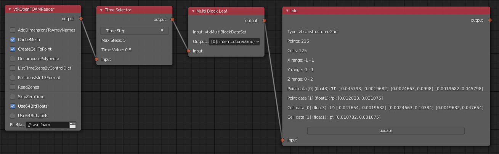

You need to select correct reader node depending on your data type. Note
that you may need to adjust reader settings and/or add *Custom Code*
(see :ref:`custom_code`)
to some readers, depending on your case and data. For example, to force
the parallel OpenFOAM reader *vtkPOpenFOAMReader* to read the decomposed
case files instead of reconstructed serial case files, you must add
custom code `SetCaseType(0)` to the reader node.

* *vtkXMLUnstructuredGridReader* for **.vtu** files
* *vtkPolyDataReader* for some **.vtk** files

The following node setups assume that the input of the first node is
connected to some data source which produces *vtkUnstructuredGrid*
with data for 3D cells, such as the output of *Multi Block Leaf* node
in example above.

.. _extract_boundary_surfaces:

Extract Boundary Surfaces
-------------------------

*vtkGeometryFilter* followed by *VTK To Blender* extracts all boundary
surfaces.

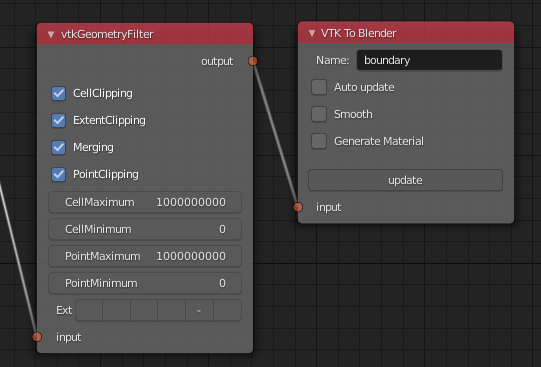

If you want to extract a single boundary patch for OpenFOAM case, you
need to

* Add **EnableAllPatchArrays()** Custom Code to *vtkOpenFOAMReader*
  (see :ref:`custom_code`).
* Add two *Multi Block Leaf* nodes in series to select patches and the
  wanted patch, before connecting to *vtkGeometryFilter*.

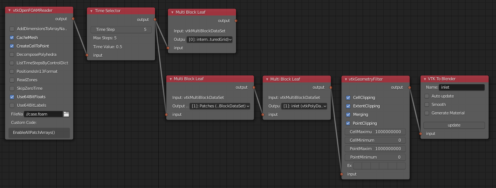

Field Data Calculations
-----------------------

You can use
*vtkArrayCalculator* to calculate new fields from existing fields.

* **Optional**: Add first *vtkPassArrays* if you want to discard other
  data arrays except the ones you use in calculations.
  You can specify which cell or point data fields
  will be operated on, by :ref:`custom_code` commands like::
  
    AddArray(vtk.vtkDataObject.CELL, "U")
    AddArray(vtk.vtkDataObject.POINT, "")

* In *vtkArrayCalculator* node, write the calculator code to **Function**
  field, the result array name to **ResultArrayName**, and select
  correct type for the **AttributeType** field. Finally you must
  specify the array names which are operated on by Custom Code like::

    AddVectorArrayName("U")

* See `the list of operators in vtkArrayCalculator docs <https://vtk.org/doc/nightly/html/classvtkArrayCalculator.html#details>`_. Some examples for **Function** field:

  * First *U* vector component can be extracted by expression like ``U.iHat``

  * *U* vector magnitude can be calculated with ``mag(U)``

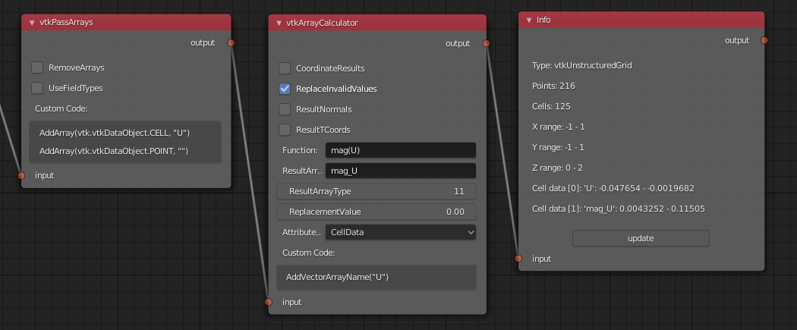

Cutting Field Data
------------------

Use *vtkCutter* in combination with a geometry generator (like
*vtkPlane*) to slice your field data. Combine with *Color Mapper* and
*Color Ramp* to color by field value.

* Connect *vtkPlane* to the **CutFunction** connector on the
  *vtkCutter* node.
* Disable **GenerateCutScalars** and **GenerateTriangles** in
  *vtkCutter* node.
* Connect *Color Ramp* to the **lookuptable** connector in the *Color
  Mapper* node.
* In the *VTK To Blender* node, you must enable **Generate Material**,
  so that result colors will be shown after final Update. Note: 3D
  Viewport must be in *Material Preview* or *Rendered* mode to see the
  colors.
* Run *Update* on the *VTK To Blender* node, then select the correct
  field for **color by** in *Color Mapper* node, fix range min and max
  if required, and click *Update* again.

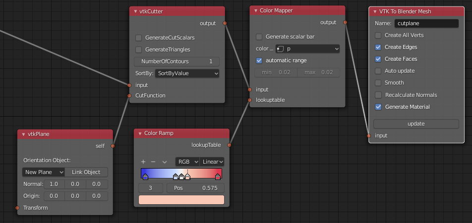

Here is the result in 3D Viewport shown in Material Preview Mode:

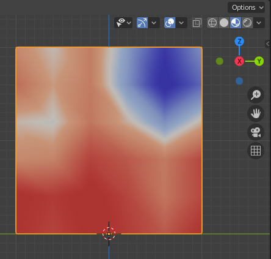

Vector Glyphs
-------------

Glyphs (like one produced by *vtkArrowSource*) can be placed at
points, oriented and scaled by *vtkGlyph3D* node. This example shows
how to color glyphs by velocity magnitude.

* Add *vtkCellCenters* node to get points of cell centers.
* Add *vtkMaskPoints* node, and adjust **MaximumNumberOfPoints** to a
  small value and set **OnRatio** to 1 (no skipping of data
  points). It is good idea to use a small value for maximum number
  of points while tuning, so that calculation does not take a long
  time.
* Add *vtkGlyph3D* node, and set **ScaleFactor** to 20, and
  **ColorMode** to ColorByVector.
* Connect *vtkArrowSource* to **input 1**, and add *Color Mapper*,
  *Color Ramp*, and *VTK To Blender* (with Generate Material enabled).
* Run *Update*, select *Vector Magnitude* in *Color Mapper* node, and
  run *Update* again.

.. note::

   Selecting a vector field to *color by* in the *Color Mapper* node
   will only use the first vector component. If vector magnitude is
   not generated by a VTK operator (like *vtkGlyph3D* does here),
   you can use *vtkArrayCalculator* upstream to generate it, see
   `Field Data Calculations`_.

.. note::

   If the glyphs are all incorrectly aligned along the positive X-axis
   even when *Orient* is on, you need to add *vtkAssignAttribute* node
   e.g. before *vtkMaskPoints*. You need to add Custom Code (see
   :ref:`custom_code`) to specify a data array to be activated, e.g.
   ``Assign("U", vtk.vtkDataSetAttributes.VECTORS, vtk.vtkAssignAttribute.POINT_DATA)``

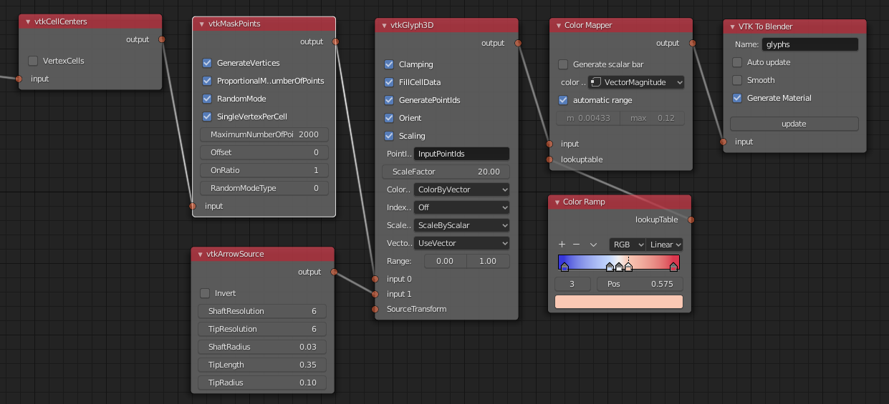

Here is the result in 3D Viewport shown in Material Preview Mode:

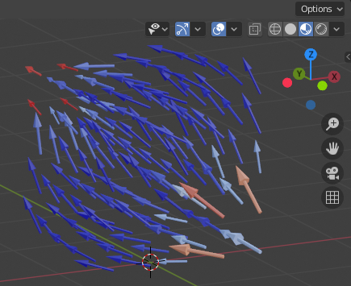

Contours
--------

Contours can be generated with *vtkContourFilter*:

* First add *vtkAssignAttribute* node and add Custom Code (see :ref:`custom_code`) to
  specify a point data array to be used for contouring, e.g.
  ``Assign("p", vtk.vtkDataSetAttributes.SCALARS, vtk.vtkAssignAttribute.POINT_DATA)``
* Add *vtkContourFilter*, and add wanted contour values by pressing
  the plus icon and then input three values: 0.017, 0.02, 0.023.
  Disable **GenerateTriangles** to retain polyhedrons.
* **Optional:** Add *vtkGeometryFilter* and modify minimum values if you
  want to test first to get only a small part of a large domain.
* Add *Color Mapper*, *Color Ramp* and *VTK To Blender* nodes. In *VTK
  To Blender* node, select both **Generate Material** and **Smooth**
  to get smoothened face normals.
* Run *Update* on the *VTK To Blender* node, select appropriate
  coloring in *Color Mapper*, and rerun *Update*.

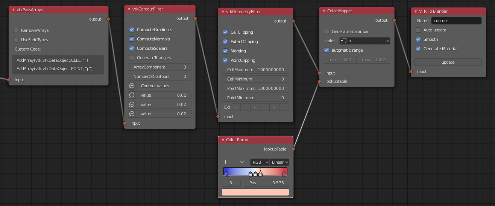

Here is the result in 3D Viewport shown in Material Preview Mode:

.. image:: images/ug_contour_result.png

Iso-surface
-----------

A closed iso-surface (a contour with no holes in surface, e.g. for
volumetric rendering) can be achieved by clipping with a value with this
approach using *vtkClipDataSet*, *vtkDataSetRegionSurfaceFilter* and
*vtkPolyDataNormals* (to get consistent face normals).
Replace *vtkPassArrays* with *vtkAssignAttribute* (see `contours`_
above) if you need to color the iso-surface with data.

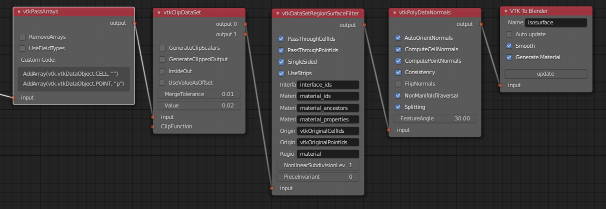

Here is the result in 3D Viewport shown in Material Preview Mode:

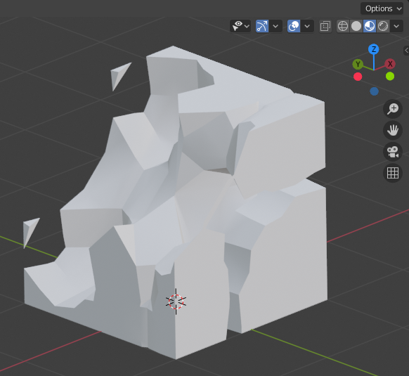

Stream Tracers
--------------

Stream tracers calculated by *vtkStreamTracer* can be visualized with
e.g. *vtkTubeFilter* using this node setup:

* Select the vector field for tracing with *vtkAssignAttribute*
  (see above) or *vtkPassArrays* like here.
* Generate source points for stream tracer with e.g. *vtkPlaneSource*
  and make sure points are inside the domain.
* Add *vtkStreamTracer* and modify settings according to your case:

  * **MaximumNumberOfSteps** should be a large value, but during
    testing phase you can use a small value to limit result mesh size.
  * **MaximumError** should be a small value like **1e-9** for smooth
    traces.
  * **MaximumPropagation** limits the length of path, should be a
    large value.
  * **MinimumIntegrationStepSize** should be a very small value like
    **1e-10** to avoid early termination.

* Add *vtkTubeFilter* and adjust at least **NumberOfSides** and
  **Radius**.
* *vtkPolyDataNormals* (without **FlipNormals**) is needed to get good
  face normals for the result.
* Finally add *Color Mapper*, *Color Ramp* and *VTK To Blender* with
  **Generate Material** and **Smooth** on.
* Run *Update* on the *VTK To Blender* node, select appropriate
  coloring in *Color Mapper*, and rerun *Update*.

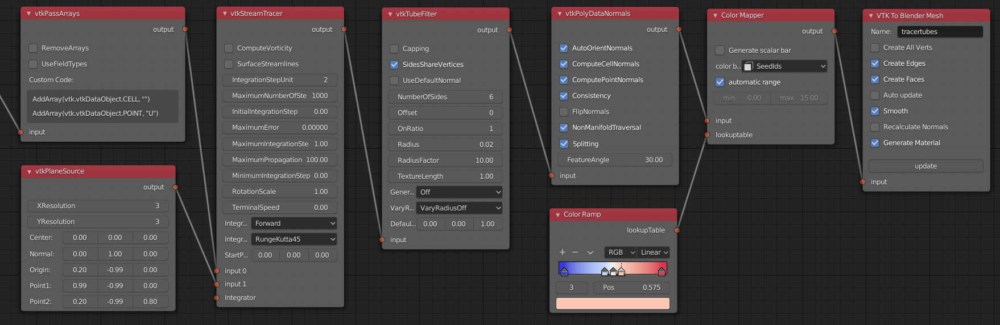

Here is the result in 3D Viewport shown in Material Preview Mode:

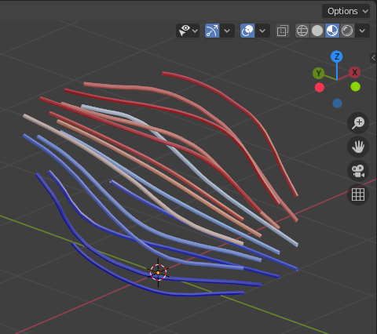

.. _volumetric_rendering:

Volumetric Rendering
--------------------

Volumetric rendering of 3D *vtkImageData* is possible by using the
experimental :ref:`VTKToBlenderVolume` node. You can use a custom
*VTKImageData Object Source* node in conjunction with *vtkProbeFilter*
to convert e.g. unstructured grid data into *vtkImageData* voxel data
required by the volumetric conversion.

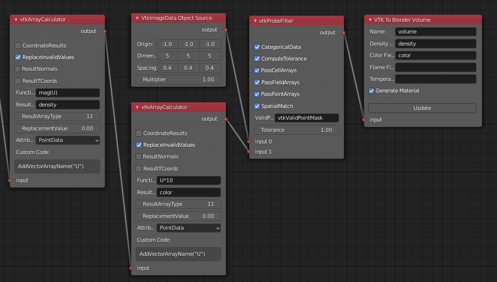

Edit the generated volumetric material in Shader Editor, node setup is
shown below. Here is the result of the example data viewed from above,
when lit only by an added Sun lamp with strength value 10. Color is
manipulated in the material by two Vector Math nodes to add red color
to velocity X component and blue color to velocity Z component.

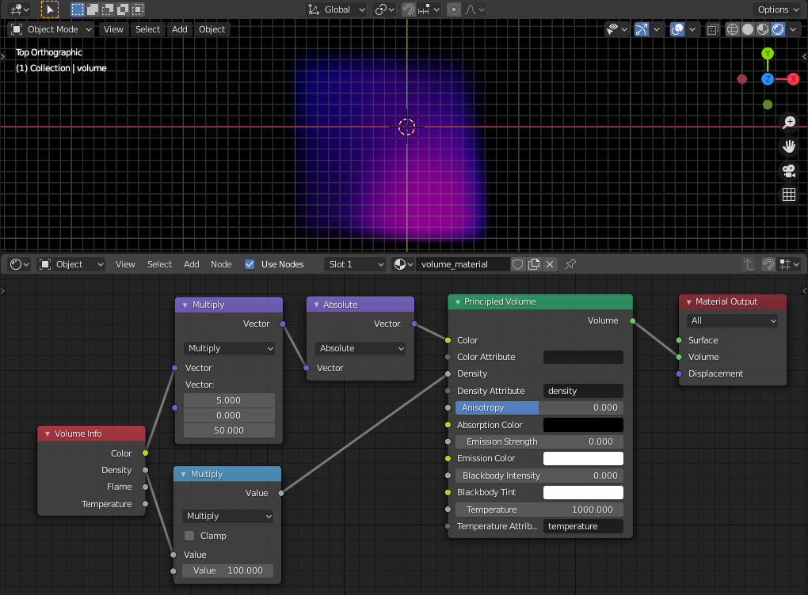
